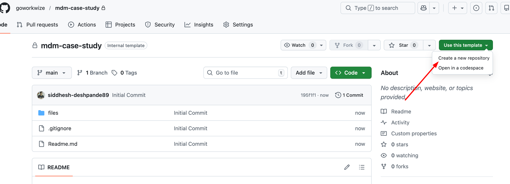
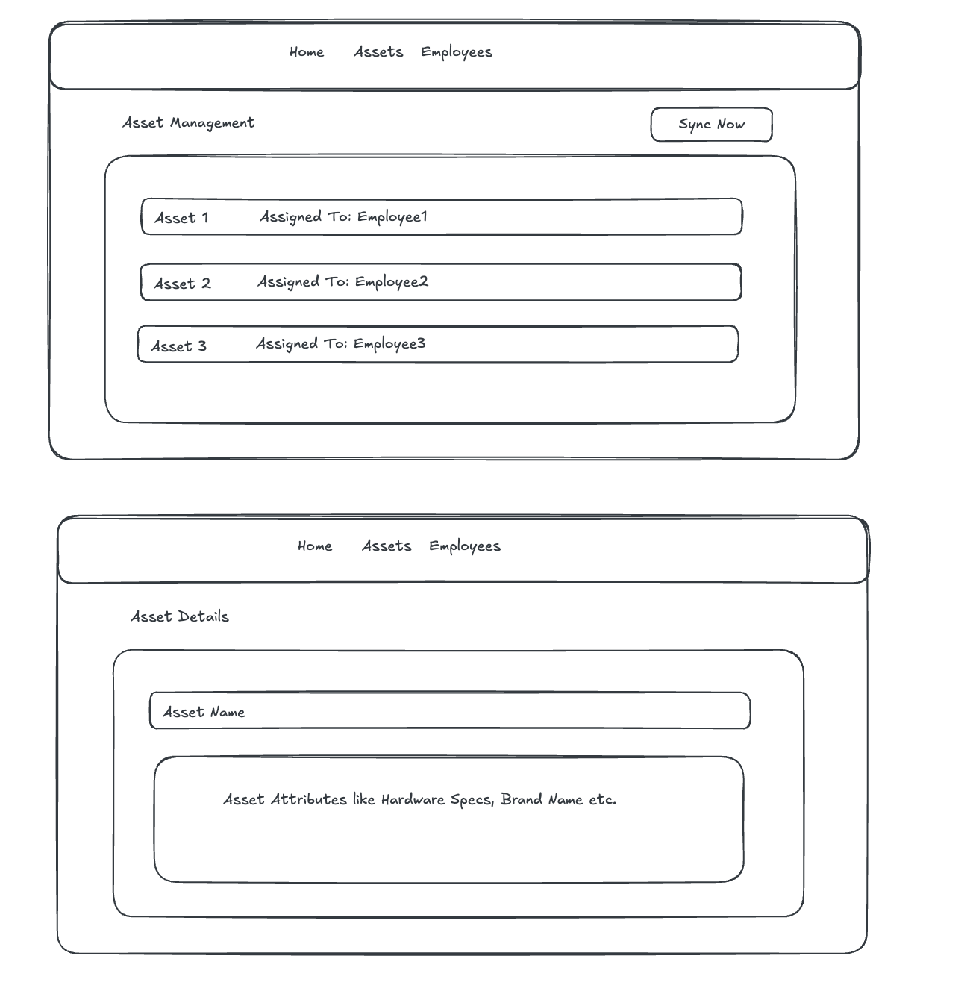

# Fullstack Assignment (4 hours): MDM Device Sync

## Context
WorkWize is an IT hardware management platform. Customers want to import **assigned devices** (devices that have a user) from MDM providers into WorkWize.  
Jamf is the only MDM provider in scope for this assignment, but also think how you can make it easier to implement future MDM providers.

---

## Key Definitions

- **Asset**  
  A device assigned to an employee. Only assigned devices are imported.

- **Asset Attributes**  
  Device specifications such as model, RAM, storage, etc.

- **Employee**  
  A user assigned to a device. Employees are uniquely identified by **email**.

---

## Goals
Create a new repository from this template.

Create a new branch for your Laravel + React project.

Refer to `files/RefJamfSyncService.php` to understand the code structure and implement an improved version of `JamfSyncService` with enhancements. Use `api-mock-response.json` as the third-party API mock response. Refer **API Flow** section below.

Build a small **Laravel + React** application that can:

- Sync assigned devices from Jamf
- Store assets and employees in **MySQL**
- Show synced assets and employees in a UI list
- The frontend only requires **delete** functionality (no manual create or edit)
- Deleting an asset or employee removes it from the local database only
- Enforce the **MDM Sync Behaviour Rules** listed below

---

## API Flow

### Third-party Jamf API
For this assignment, use the provided mock response file:
- `files/api-mock-response.json`

Your Laravel backend should read this JSON file directly when syncing devices.

### Laravel Backend API
Your React frontend should **not** read the JSON directly.  
Instead it should call your Laravel backend endpoints, for example:

- `POST /api/sync/jamf`  
  Triggers a sync. The backend reads `files/api-mock-response.json`, applies the rules, and persists to MySQL.

- `GET /api/assets`  
  Returns the synced assets for the UI list.

- `DELETE /api/assets/{id}` and/or `DELETE /api/employees/{id}`  
  Removes the record from the local database only.

---

## MDM Sync Behaviour Rules

- Asset uniqueness is determined by **serial code**
- Employee uniqueness is determined by **email**
- Unassigned devices (no employee email) must not be imported
- After sync, device details must be visible in the assets list
- If an employee does not exist, it must be created
- Jamf is the source of truth for device assignments
- Re-running sync must recreate deleted assets or employees
- Any changes to device assignment or attributes in the mock response must be reflected after sync  
  _Example: RAM changes from 8GB to 16GB must be reflected after sync_

---

## Timebox

⏱️ **4 hours**

If you run out of time:
- Document what you would do next
- Call out known limitations or shortcuts
